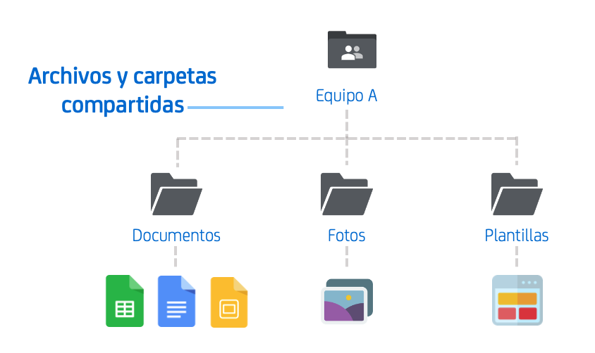

## Cultura de equipo remoto
👩‍💼 Adaptarse al cambio significa generar las condiciones necesarias para el trabajo a distancia.

Lograr un ambiente para el trabajo remoto efectivo comienza por los directores y tomadores de decisiones de las instituciones públicas, es esencial entender la importancia de definir una estrategia para los distintos equipos que estarán trabajando a distancia.  La tarea de los líderes de equipo es poner en marcha procesos inclusivos para implementar esta estrategia y corregir los comportamientos no amigables para el trabajo remoto con el fin de lograr una experiencia exitosa para todos.

La clave para construir buenas relaciones a distancia es la intención, debemos esforzarnos más de lo habitual para encontrar intereses comunes, tener reuniones significativas y comprender verdaderamente la perspectiva de cada persona. Para esto todos debemos tener en cuenta lo siguiente:

- **La empatía lo es todo**, siempre asumir una intención positiva. El tono y los matices pueden perderse en un chat o una videollamada, por lo que asumir que nuestros compañeros vienen de una posición positiva ayuda con cualquier posible malentendido.
- **Tratemos a los demás con transparencia**, mantengamos la información importante al alcance de todos, registrando las decisiones tomadas, grabando las reuniones y siempre tomando notas para compartir con los demás.
- **Esperar estructura**, establecer un proceso y definir una agenda alrededor de las reuniones y actualizaciones para que todos puedan seguir el hilo sin importar su ubicación.
- **Diferentes pero iguales**, aceptar esta realidad fundamental en donde todos los miembros remotos del equipo son iguales, pero sus experiencias difieren. La clave es ser empático con la situación particular de cada uno.

### Entorno de trabajo personal
Trabajar a distancia tiene aspectos positivos y negativos, es por eso que debemos ser conscientes de cómo nos debemos adaptar y preparar adecuadamente.

  <input type="checkbox" id="cbox1" class="d-block float-left mt-1 mr-2" value="checkbox">
  <label for="cbox1" class="overflow-hidden d-block text-normal">
    <b>Diseña tu rutina de trabajo</b>, incluyendo pausas para estirar, tomar agua, salir a tomar el sol, etc. Puede revisar <a href="https://blog.trello.com/es/rutina-diaria-de-trabajo">éste artículo</a> sobre cómo crear una rutina diaria de trabajo efectiva.
  </label>

  <input type="checkbox" id="cbox2" class="d-block float-left mt-1 mr-2" value="checkbox">
  <label for="cbox2" class="overflow-hidden d-block text-normal">
    Crea un calendario compartido con tu equipo que incluya las <b>horas de trabajo disponibles</b>. Esto facilita el programar llamadas o citas y te permite controlar tu tiempo, puedes usar <a href="https://docs.google.com/spreadsheets/d/1Otp1O7-W8eJ01RaD0RIp7bnAASlPbodA2cLVzYteq9c/edit?usp=sharing">ésta plantilla</a>.
  </label>

  <input type="checkbox" id="cbox3" class="d-block float-left mt-1 mr-2" value="checkbox">
  <label for="cbox3" class="overflow-hidden d-block text-normal">
    <b>Escoge tu espacio de trabajo</b>. Aunque puede sonar atractivo trabajar desde la cama, esto borra la línea entre nuestro lugar de trabajo y el de descanso esto puede ser contra productivo. Designa una mesa donde te sientas cómodo y <b>arma el ambiente ideal para ser productivo</b>.  Te dejamos <a href="https://www.3buro.mx/blog/mejorar-tu-espacio-de-trabajo/">estos tips</a>.
  </label>

## Estructurar el trabajo remoto
🗂 Al igual que el trabajo presencial, el trabajo a distancia requiere de igual o mayor nivel de planificación de las tareas para que se cumplan los objetivos.

Para realizar el trabajo a distancia es fundamental contar con herramientas de colaboración en línea y de comunicación remota que nos permitan trabajar de manera conjunta y comunicarnos en tiempo real, tratando de replicar la dinámica que llevamos en la oficina.  En general, las distintas dependencias y e instituciones públicas cuentan con algún paquete de ofimática en línea, ya sea *Google G Suite* o *Microsoft Office 365* . La recomendación es que utilicemos las herramientas que ya nos provee nuestro correo institucional.

### Identificación de tareas a desarrollar a distancia
Como punto de partida, podemos hacer un mapeo de todos los procesos o tareas de nuestro equipo, identificando cuáles pueden ser realizadas de manera remota, cuáles se pueden adaptar y cuáles no se pueden realizar y priorizar de acuerdo a su importancia.

- **Tareas que funcionan de manera remota** - Todas las tareas y procesos que por su naturaleza son digitales y se realizan siempre en línea, ya sea a través de correo, chat o cualquier plataforma digital.
- **Tareas que se pueden adaptar de manera remota** - Todas las tareas y procesos que pueden de alguna manera adaptarse para que realicen de manera remota o se adapten de manera parcial para cumplir el mismo objetivo.
- **Tareas que no se pueden realizar de manera remota** - Todas las tareas y procesos que por su naturaleza requieren de actividades presenciales y que no se podrían realizar de cualquier otra manera.

> 👉Puedes usar el siguiente [formato](https://docs.google.com/document/d/1LRhF6wj1i4_IqVnEdarabT-68XYSUZ-IjEk90S9ayEQ/edit?usp=sharing) para hacer esta actividad.👈

### Definir el trabajo de la semana
Es necesario desarrollar un plan semanal que considere las tareas a nivel personal y a nivel colectivo que se requieren y generar las condiciones para controlar y coordinar el avance de su cumplimiento. Realiza los siguientes pasos:

1. Definir los objetivos a cumplir por el equipo durante la semana.
2. Determinar en conjunto las tareas a realizar para el cumplimiento de los objetivos.
3. Clasificar las tareas que se realizan de manera individual y cuáles corresponden a un trabajo colaborativo en equipo, definiendo siempre a un responsable final.
4. Acordar metas individuales de trabajo semanal y metas semanales del trabajo grupal.
5. Acordar las sesiones grupales remotas para las tareas que requieren colaboración del equipo.
6. Revisar el cumplimiento de los avances del trabajo y revisar individualmente con cada miembro del equipo las dificultades que tuvo en el desarrollo de su trabajo.
7. Retroalimentar a los miembros del equipo respecto de los avances y desafíos a abordar.

> 👉Puedes usar el siguiente [formato](https://docs.google.com/spreadsheets/d/1wLQOm11e-ktCu5lWVy9bGDOgkayXzDSgAGOv05MBac8/edit?usp=sharing) para hacer esta actividad.👈

**Recomendación:**
Haz el seguimiento a tareas usando [Kanban](https://blog.trello.com/es/metodologia-kanban), esta metodología plantea la importancia de la visualización del trabajo por parte de todos los miembros del equipo, normalmente en un tablero físico en la oficina, y en este caso un tablero “virtual” (recomendamos [Trello](https://trello.com/home) para esto), para poder saber el estado de avance de las tareas y poner foco en el término de tareas en vez de abrir demasiadas tareas en paralelo con el riesgo de no finalizarlas.

### Estructurar el espacio digital de trabajo
Ahora que ya tenemos una idea de los que podríamos o no podríamos hacer de manera remota, debemos de estructurarlo en un espacio de trabajo compartido. Es muy importante que la mayor cantidad de información esté disponible para todos en todo momento, por esta razón los archivos y documentos compartidos en la nube son necesarios.

> 👉Ejemplo de [guía de estructura](https://drive.google.com/file/d/1bHJr8_rHJTceW131JfOb4zhvKVf3DjUv/view?usp=sharing) de archivos compartidos y documentos colaborativos.👈

## Retroalimentación
🙌 La sobre comunicación es muy importante cuando se trabaja de manera remota.

La comunicación es esencial ya que trabajando a distancia se pierden muchos de los detalles e intenciones que normalmente estamos acostumbrados a percibir a través del lenguaje corporal. Es recomendable tener un **Stand-up diario**, esto es una reunión muy corta (15 min) con todos los miembros del equipo para ver los avances que tuvieron durante el día anterior en donde realicemos las siguientes preguntas:

1. **¿Qué hice ayer?**
2. **¿Qué voy a hacer hoy?**
3. **¿Qué te está impidiendo progresar?**

Los miembros del equipo deben conocer la estructura, la duración y las expectativas de las reuniones del equipo, nada es más eficiente que una reunión en la que todos los interesados sepan qué se está discutiendo, cuánto durará y qué preparar. En un inicio es recomendable hacerlo de manera diaria y una vez que se sientan cómodos cambiar a hacerlo solo una vez a la semana. Puedes consultar [estas recomendaciones](https://blog.kezmo.com/consejos-%C3%A1giles-para-stand-up-meetings-reuniones-diarias-281352668406).
